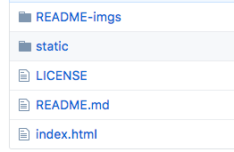
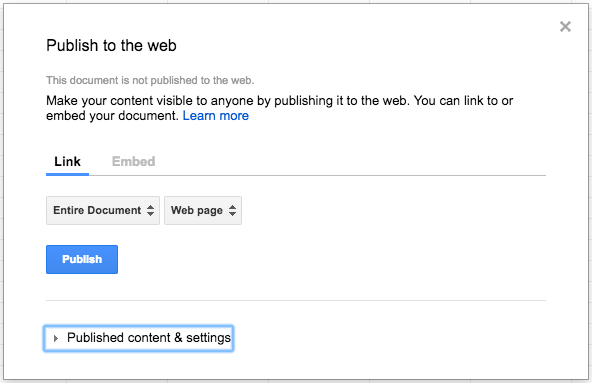

# DIY Identify
### Create your own online image guessing game

> The resources in this repository and the directions in this README allow you to create an interactive image guessing game using your own imagery and data. This template utilizes GitHub as a web hosting platform and Google Sheets as a data server. All preparations can be done online without downloading or installing any tools.

An example completed application using the contents of this repository is available here: https://waltgurley.github.io/diy-identify/.

The images for this example are located in [this repository](https://github.com/WaltGurley/diy-identify/tree/gh-pages) in the directory `./static/images`, and the data is located in [this Google Sheet](https://docs.google.com/spreadsheets/d/1Ew_tsLL-TxHdKuFHkeq807o9gEOekfPvKjFiecznDqc/edit#gid=0)

Prerequisites
===
Before you begin creating your own application you must have access to a [GitHub account](https://github.com/join?source=header-home) and a [Google account](https://accounts.google.com/SignUp?continue=https%3A%2F%2Fmyaccount.google.com/intro).

Directions
===

Follow the steps below to create your own image guessing game. There are five main parts:

1. Fork the DIY Identify repository (i.e., make a copy of the base code in your own GitHub account)
2. Prepare your data in Google Sheets
3. Connect your app to the Google Sheets workbook
4. Add your images to GitHub
5. Publish your page

All of these steps can be completed in the browser. It is recommended to have these instructions open in a separate browser tab for reference.

Fork the DIY Identify repository
---
_You will create a copy of the **DIY Identify** repository in your own GitHub account_

1. On the [DIY Identify repository page](https://github.com/WaltGurley/diy-identify) click the `Fork` button in the upper righthand corner.

2. If prompted, select the user account to which you would like to fork this repository.

3. You should now have a copy of the DIY Identify repository with all the necessary folders and files under your own account. Keep this repository open in a tab in your browser.

  

Prepare your data in Google Sheets
---
_You will copy a blank spreadsheet workbook and format it with your data_

1. Open [this Google Sheets workbook](https://docs.google.com/spreadsheets/d/1BeJqRNDOvBe3LXxhikp06VXvT0NTYfQJL-t2x9sb02E/edit#gid=1425704101) in a new tab in your browser.

2. Select `File > Make a copy...` and add a copy of this workbook to your own Google Drive. You can rename this workbook as you see fit.

3. This workbook contains two sheets: _Image Info_ and _App Info_. Select the `Image Info` tab to begin adding the information for the images that will compose your application. Each row in _Image Info_ contains the necessary information for an image to function in your image guessing game. Fill out the information for each of your images as such:

  * **Image Name:** The complete name of this image file, **including the extension** (.jpg, .png, etc.). For example, millipede.jpg.

  * **Entity Name:** The name of the entity that is identifiable in this image. *This column of names will be used to randomly generate choices in the game.*

  * **Entity Description:** A short, less than one paragraph, description of the identifiable entity in the image that a user will see if they correctly identify the image.

    Example content:

    | Image Name | Entity Name	| Entity Description |
    |---|---|---|
    | acrobat_ant.jpg | acrobat ant | The scientific name of this insect is: Formicidae Crematogaster sp |
    | assassin_bug.jpg |	assassin bug	| The scientific name of this insect is: Reduviidae Pselliopus sp |
    | snail.jpg	| snail |	The scientific name of this insect is: Prob Polygyridae |

4. Select the `App Info` tab and add the necessary information for your application display:

  * **App Name:** The name of your application. This will appear at the top of the application page.

  * **Group Name:** The name of the person or group creating the application. This will appear at the top of the application page.

  * **Image Entities:** The general type of entity that describes the entities in your images. For example, pictures of insects would by described as Insects.

  * **Site Link:** A link to your/your group's website. This will appear in the information popup accessible via the info button.

  * **App Description** A description of your application. This can be one to several paragraphs providing the user with background on the image series and the person/group behind creating the application. This will appear in the information popup accessible via the info button.

    Example content:

    | App Name | Group Name | Image Entities | Site Link | App Description |
    |---|---|---|---|---|
    |Insect Identifier	| Digital Library Initiatives	| Insects |	http://go.ncsu.edu/diy-identify	| This image guessing game application was built using a web template developed at NCSU Libraries... |

Connect your app to the Google Sheets workbook
---
_You will publish the workbook you just edited and link it to your GitHub repository_

1. In your workbook select `File > Publish to the web...`. Ensure that you are publishing a _Link_ with the _Entire Document_ as a _Web page_. Select `Publish` and confirm by selecting `OK`. Close the _Publish to the web_ popup.

  

2. Copy the URL from the address bar. It will look something like this: `https://docs.google.com/spreadsheets/d/1fRayIfFSIymfAK_LMTGFJBvMW0Nuk3NQu0gu2xG5oJM/edit#gid=0`

3. Switch to the browser tab in which your GitHub repository is opened. Open the `static` folder to navigate to its contents.

4. Open the file `config.json`. Select the `Edit this file` button  to open the file in edit mode.

5. Replace the text _YOUR GOOGLE SHEET URL_ in this file with the URL you copied from your Google Sheets workbook. **Important: make sure the URL is surrounded by double quotes `" "`**. For example:

  ```json
  {
    "GoogleSheetsURL": "https://docs.google.com/spreadsheets/d/1Ew_tsLL-TxHdKuFHkeq807o9gEOekfPvKjFiecznDqc/edit#gid=0"
  }
  ```

6. Select `Commit changes` to confirm the edit to the code.

Add your images to GitHub
---
_You will upload the images you referenced in the workbook to GitHub_

1. In the tab in which your GitHub repository is opened navigate to the `static` folder and then to the `images` folder.

2. Select the `Upload files` button, select _choose your files_ and browse to the location of the files with the same names as the files you referenced in the _Image Name_ column of your _Image Info_ spreadsheet, and select `Open`. **Important: Make sure the image names exactly match the names you put in column one of _Image Info_**

3. Select `Commit changes` to confirm the new file additions. Uploading many images may take several minutes.

Publish your page
---
_You will publish a page built from the resources in your repository and the linked Google Sheets workbook_

1. In the tab in which your GitHub repository is opened click on the `Settings` button at the top of the page.

2. Scroll down to the _GitHub Pages_ section. Under _Source_ select `None`, then select `master branch` and then `Save`.

3. You will receive a confirmation in the _GitHub Pages_ section indicating that your site is ready to be published and the URL at which it is available.

4. Select this URL to navigate to your new application. You will share this URL with anyone you would like to access your image identification game.

5. Look over the page to ensure all information is loaded correctly from your spreadsheet.

  * Your _App Name_ and _Group Name_ should be displayed at the top of the screen.

  * If you select the `info icon` a popup should appear with your _App Description_ and _Site Link_.

  * Start the game to check that the total number of images in the score represents the number of images in your spreadsheet.

  * You can also play through the game to check that all the images load.

  If you have any issues check the [Troubleshooting](#troubleshooting) section below.

Troubleshooting
===
**The application does not load completely**

Make sure that you have correctly referenced the URL in the `config.json` file. See [Connect your app to the Google Sheets workbook](#connect-your-app-to-the-google-sheets-workbook).

**Some or all of the application data does not display**

Make sure that all the data in row one of the _App Info_ spreadsheet is filled in.

**Some of the images do not show up**

Make sure that the name of the image you uploaded to GitHub matches the name you put into the first column of the _Imaage Info_ spreadsheet.

About
===

This template was developed at [NCSU Libraries](https://www.lib.ncsu.edu/). For more information on digital development at NCSU Libraries see the [Digital Library Initiatives](https://www.lib.ncsu.edu/department/digital-library-initiatives) project and initiatives page: https://www.lib.ncsu.edu/dli/projects.

The photographs and insect information was supplied by Matt Bertone from the NCSU Department of Entomology & Plant Pathology. See more of Matt's photos on his [flickr page](https://www.flickr.com/photos/76790273@N07/).

This template was built using the Vue.js framework based on an Angular project built by Sourrabh Saha.

Authors
---

Walt Gurley

Sourrabh Saha
